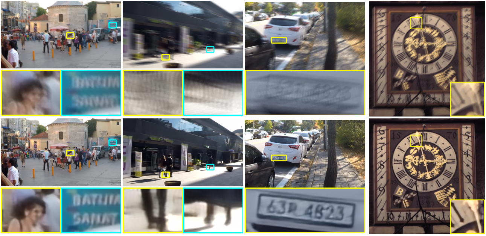
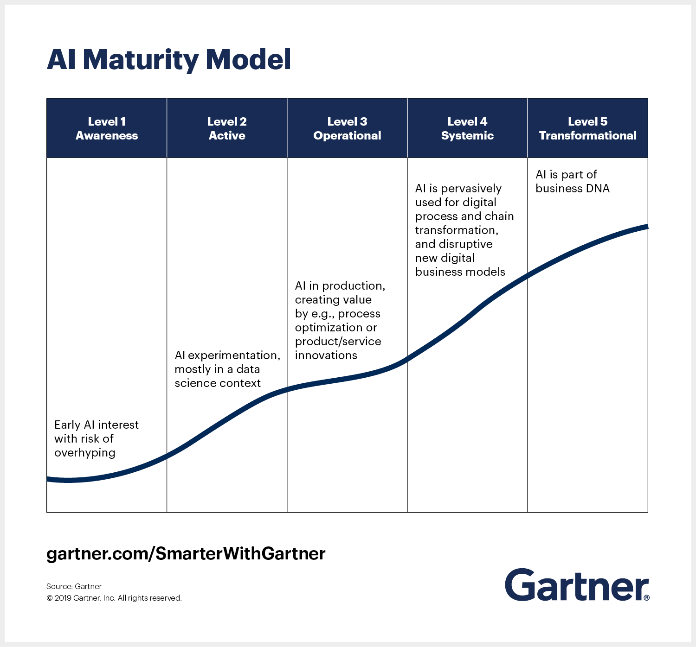
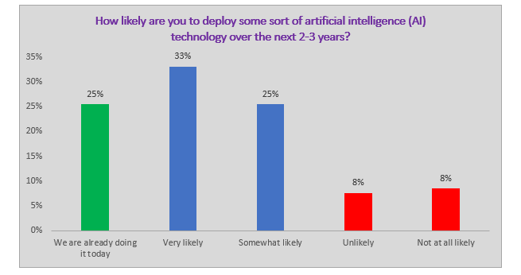
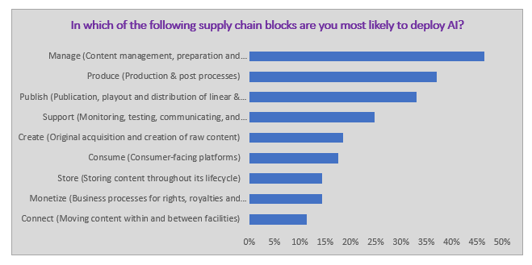

# The impact of AI on broadcasting

## Introduction
Creating video used to be prohibitively expensive, requiring specialized equipment and a dedicated team. This changed in 1987, when NewTek announced the Video Toaster, a linear video editor that cost less than $5000 to set up, with all you need being a VCR, Commodore Amiga, and of course, the Video Toaster hardware. Around the same time, the Avid/1 Media Composer was released, bringing non-linear video editing to the masses. Ever since then, the process had been getting more automated and streamlined, as well as becoming more and more accessible. And now, of course, NLEs are commonplace and tools like OBS Studio and the ATEM Mini have made live switching more feasible than ever.

So clearly, there is a trend of broadcasting technologies becoming cheaper and more accessible over time. But what's next in broadcasting? What new technologies are in the horizon? Will they make a difference?

Feel free to [skip around](#table-of-contents).

## Table of Contents
- [The impact of AI on broadcasting](#the-impact-of-ai-on-broadcasting)
  - [Introduction](#introduction)
  - [Table of Contents](#table-of-contents)
  - [A couple of technologies.](#a-couple-of-technologies)
    - [DeepFakes](#deepfakes)
      - [Minor Errata](#minor-errata)
    - [Remastering and upscaling](#remastering-and-upscaling)
    - [Fixing camera shakiness](#fixing-camera-shakiness)
    - [Style Transfer](#style-transfer)
  - [Feasibility](#feasibility)
  - [Bad Actors](#bad-actors)
  - [Impact](#impact)
  - [Conclusion](#conclusion)

## A couple of technologies.
Let's start by taking a look at what AI can do with video.

### DeepFakes
Let's get the one everyone already knows about out of the way. DeepFakes are a general name for methods that allow you to swap people's faces or to fake what someone is saying.

The ability to do this is nothing new, but previously it required multiple skilled VFX and 3D artists to manually composite on a virtual face scan.
<iframe width="560" height="315" src="https://www.youtube.com/embed/dAaLqaofSho" frameborder="0" allow="accelerometer; autoplay; encrypted-media; gyroscope; picture-in-picture" allowfullscreen></iframe>

[DeepFakes](https://www.youtube.com/watch?v=OCLaeBAkFAY) caused a lot of panic because of their automated nature, but in order to make them you had to carefully curate a large dataset of the face you are trying to fake in.

What you might not know is that recent advancements mean that you no longer need that large dataset, and can instead just use a single image to create DeepFakes.
<iframe width="560" height="315" src="https://www.youtube.com/embed/mUfJOQKdtAk" frameborder="0" allow="accelerometer; autoplay; encrypted-media; gyroscope; picture-in-picture" allowfullscreen></iframe>

#### Minor Errata
 - You can also [clone audio](https://github.com/CorentinJ/Real-Time-Voice-Cloning).
 - There are also [ways to detect DeepFakes](https://www.youtube.com/watch?v=RoGHVI-w9bE).

### Remastering and upscaling
A single frame of 35mm film has a resolution of ([by some calculations](https://istillshootfilm.org/post/114131916747/the-real-resolution-of-film-vs-digital)) 156MP. We don't digitize it anywhere near that, of course, with 4K footage containing around 8.5MP, depending on which standard you use. This is made worse by chroma subsampling, where colour information is stored at half the video resolution[^chromasimple]. This means that film is a really great *ground truth* to create "lower quality" versions out of, and the quality we can derive from film will only keep going up from here.

However, this is not the case with video/television, where WYSIWYG. You fimed something at 525 or 625 scanlines? It's interlaced? Stored on magnetic tape? Good luck restoring that.

You'd need to add detail that was never in the original source to begin with.

But what if you *could* do just that? So far, attempts to do so have been dodgy at best:

](interpolation.webp)
via the [matplotlib documentation](https://matplotlib.org/gallery/images_contours_and_fields/interpolation_methods.html)

Not anymore though, thanks to advances in artificial intelligence/deep learning:

(Bicubic is one of the methods demonstrated in the above image, and is the de-facto industry-standard scaling algorithm. HR is the original image.)

](esrgan1.jpg)

](esrgan2.jpg)
via [xinntao/ESRGAN](https://github.com/xinntao/ESRGAN)

Of course, nothing stops these same methods from being used on being used when remastering and especially colorizing film:
<video controls="" src="http://iizuka.cs.tsukuba.ac.jp/projects/remastering/data/remastering_siggraphasia2019.mp4" width="512"></video>

Another recent development is real-time upscalers, which, as the name suggests, upscale video (or other graphics) as they're being played.

](anime4k.png)
via [bloc97/Anime4K](https://github.com/bloc97/Anime4K/

Here's an explanation and demo from NVIDIA about their DLSS upscaling technology, which upscales games in real-time in the same exact way you would video:

> <iframe width="560" height="315" src="https://www.youtube.com/embed/BeScfkCm3b4?start=73" frameborder="0" allow="accelerometer; autoplay; encrypted-media; gyroscope; picture-in-picture" allowfullscreen></iframe>
> This is particularly impressive as games are very latency intensive, meaning that every millisecond spent processing counts.

### Fixing camera shakiness
top: frame from original video
bottom: after running through the **S**cale-**I**terative **U**pscaling **N**etwork for Image Deblurring

adapted from [minyuanye/SIUN](https://github.com/minyuanye/SIUN)

### Style Transfer
This is by far the coolest one, allowing you to turn video into paintings with just one (sometimes more) keyframe(s). No amount of human work can do this.
<iframe width="560" height="315" src="https://www.youtube.com/embed/SLDJab9E70g" frameborder="0" allow="accelerometer; autoplay; encrypted-media; gyroscope; picture-in-picture" allowfullscreen></iframe>

Of course, there's no reason the keyframes can't be [drawn by AI](https://github.com/Yijunmaverick/UniversalStyleTransfer).

## Feasibility
So, we've established that all of these things are technically possible. But are they feasible to implement in current workflows? Yes, they are.

Everything mentioned above is open source software, which means that all you need to get started apart from tech knowledge and time is the right hardware:
 - A modern CPU.
 - Lots of RAM. (at least 16GB)
 - Lots of storage.
 - A modern Nvidia graphics card. (4GB+)

Except you don't even need any of that. You can just rent a server by the hour, or even use [the free ones Google is giving away](https://colab.research.google.com/notebooks/intro.ipynb). Or [the other free ones Google is giving away](https://colab.research.google.com/notebooks/intro.ipynb).

The biggest barrier to entry is tech knowledge, but as time goes on these will become simpler and more accessible.

Of the above, the following are end-user friendly(-ish):
 - [DeepFakes](https://colab.research.google.com/github/AliaksandrSiarohin/first-order-model/blob/master/demo.ipynb) (runs for free in Google Colab)
 - [Anime4K Upscaler](https://github.com/bloc97/Anime4K/blob/master/GLSL_Instructions.md) with [mpv](https://mpv.io/) (everything but iOS)
 - [Anime4K on Crunchyroll](https://medium.com/crunchyroll/scaling-up-anime-with-machine-learning-and-smart-real-time-algorithms-2fb706ec56c0#how-to-play-with-real-time-upscaling) (on any modern desktop browser; instructions at bottom of linked article)
 - [Style Transfer](https://ebsynth.com/) (Windows with Nvidia GPU)
 - Also worth a look is [GPT-2](https://openai.com/blog/better-language-models/), an AI that writes, in [Google Colab](https://colab.research.google.com/github/ilopezfr/gpt-2/blob/master/gpt-2-playground_.ipynb).
 - And a [huge list](https://github.com/tugstugi/dl-colab-notebooks) of other Colab notebooks.

## Bad Actors
So, turns out that this technology is actually pretty accessible. And clearly some of this technology can be used for evil.

All technology has always been a double edged sword. Sure, it'll help people, but it will also invariably hurt some of them.

However, holding this research back from the public does not help anyone. It just means that the bad people will have to implement it themselves is all. It wouldn't stop them.

What does help is having these tools be as accessible as possible, so people know what could be done with them and so that all researchers and programmers can take a look at them to figure out how we can make sure that bad actors cannot exploit these systems:
 - We can make DeepFakes, but [we can also detect them](https://www.youtube.com/watch?v=RoGHVI-w9bE). (they also have very obvious artifacts if you know where to look)
 - We can fake voices but [they can be detected](https://github.com/dessa-oss/fake-voice-detection).
 - We can generate fake news, but [we can also detect it](https://huggingface.co/openai-detector). ([detailed article](https://www.analyticsvidhya.com/blog/2019/12/detect-fight-neural-fake-news-nlp/))

## Impact
I think by now that it's pretty obvious that AI will make an impact on broadcasting as well as media in general. But how much, and when?

Well, it already has.

Levels of maturity:
1. DeepFakes go viral.
2. All of the other methods mentioned above are made and refined.
3. AI is in use by end-users.

So, it's safe to say that we're probably around halfway through L3 now, though you probably never even noticed.

 via the [IABM Media Tech Trends - Artificial Intelligence](https://theiabm.org/media-tech-trends-artificial-intelligence-2019/) report, October 2019

As you can see, AI in broadcasting is currently mostly used for media management tasks right now, such as logging and adding metadata to video without any human input and to automatically pick out highlights.

This is followed by production, which includes the methods discussed in this paper and amy others, and publishing, which is nothing new, as encoding, decoding, network optimization, etc. are fields where AI is so ubiquitous that no one calls it AI, seeing as it's been a thing for decades.

## Conclusion
Change is coming. It's already begun. Sure, it is somewhat unwieldy today, but give it a year or two.

But I think we've also seen that AI will not replace humans any time soon and instead simply open up new possibilities and probably even new jobs.

But really, this is just predicting the future, and the best thing to do is to start messing around with these tools and see what you can make with them. [Do things.](#feasibility)