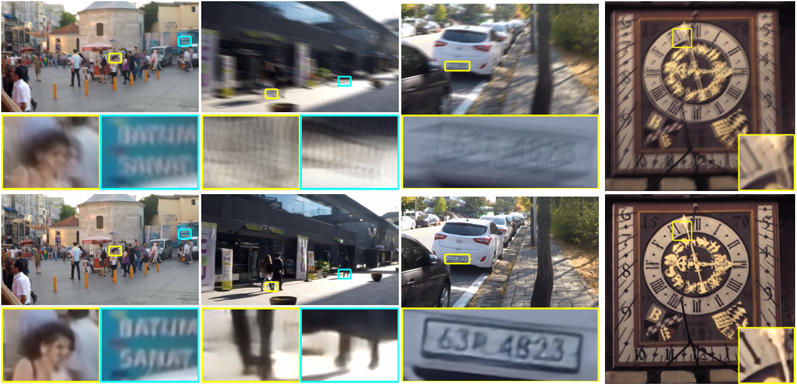

# The impact of AI on broadcasting

### Abstract
TBA

## Table of Contents
- [The impact of AI on broadcasting](#the-impact-of-ai-on-broadcasting)
    - [Abstract](#abstract)
  - [Table of Contents](#table-of-contents)
  - [Introduction](#introduction)
  - [A couple of technologies.](#a-couple-of-technologies)
    - [Deepfakes](#deepfakes)
      - [Minor Errata](#minor-errata)
    - [Remastering and upscaling](#remastering-and-upscaling)
    - [Fixing camera shakiness](#fixing-camera-shakiness)
    - [Style Transfer](#style-transfer)
  - [Feasibility](#feasibility)
  - [Bad Actors](#bad-actors)

## Introduction
Creating video used to be prohibitively expensive, requiring specialized equipment and a dedicated team. This changed in 1987, when NewTek announced the Video Toaster, a linear video editor that cost less than $5000 to set up, with all you need being a VCR, Commodore Amiga, and of course, the Video Toaster hardware. Around the same time, the Avid/1 Media Composer was released, bringing non-linear video editing to the masses. Ever since then, the process had been getting more automated and streamlined, as well as becoming more and more accessible. And now, of course, NLEs are commonplace and tools like OBS Studio and the ATEM Mini have made live switching more feasible than ever.

So clearly, there is a trend of broadcasting technologies becoming cheaper and more accessible over time. But what's next in broadcasting? What new technologies are in the horizon?

Feel free to [skip to the analysis]().

## A couple of technologies.
### Deepfakes
Let's get the one everyone already knows about out of the way. DeepFakes are a general name for methods that allow you to swap people's faces or to fake what someone is saying.

The ability to do this is nothing new, but previously it required multiple skilled VFX and 3D artists to manually composite on a virtual face scan.
<iframe width="560" height="315" src="https://www.youtube.com/embed/dAaLqaofSho" frameborder="0" allow="accelerometer; autoplay; encrypted-media; gyroscope; picture-in-picture" allowfullscreen></iframe>

[DeepFakes](https://www.youtube.com/watch?v=OCLaeBAkFAY) caused a lot of panic because of their automated nature, but in order to make them you had to carefully curate a large dataset of the face you are trying to fake in.

What you might not know is that recent advancements mean that you no longer need that large dataset, and can instead just use a single image to create DeepFakes.
<iframe width="560" height="315" src="https://www.youtube.com/embed/mUfJOQKdtAk" frameborder="0" allow="accelerometer; autoplay; encrypted-media; gyroscope; picture-in-picture" allowfullscreen></iframe>

#### Minor Errata
 - You can also [clone audio](https://github.com/CorentinJ/Real-Time-Voice-Cloning).
 - There are also [ways to detect DeepFakes](https://www.youtube.com/watch?v=RoGHVI-w9bE).

### Remastering and upscaling
A single frame of 35mm film has a resolution of ([by some calculations](https://istillshootfilm.org/post/114131916747/the-real-resolution-of-film-vs-digital)) 156MP. We don't digitize it anywhere near that, of course, with 4K footage containing around 8.5MP, depending on which standard you use. This is made worse by chroma subsampling, where colour information is stored at half the video resolution[^chromasimple]. This means that film is a really great *ground truth* to create "lower quality" versions out of, and the quality we can derive from film will only keep going up from here.

However, this is not the case with video/television, where WYSIWYG. You fimed something at 525 or 625 scanlines? It's interlaced? Stored on magnetic tape? Good luck restoring that.

You'd need to add detail that was never in the original source to begin with.

But what if you *could* do just that? So far, attempts to do so have been dodgy at best:

](interpolation.webp)

Not anymore though, thanks to advances in artificial intelligence/deep learning:

(Bicubic is one of the methods demonstrated in the above image, and is the de-facto industry-standard scaling algorithm. HR is the original image.)

](esrgan1.jpg)

](esrgan2.jpg)

| Of course, nothing stops these same methods from being used on being used when remastering and especially colorizing film:
| <video controls="" src="http://iizuka.cs.tsukuba.ac.jp/projects/remastering/data/remastering_siggraphasia2019.mp4" width="512"></video>

Another recent development is real-time upscalers, which, as the name suggests, upscale video (or other graphics) as they're being played.

](anime4k.png)

Here's an explanation and demo from NVIDIA about their DLSS upscaling technology, which upscales games in real-time in the same exact way you would video:

> <iframe width="560" height="315" src="https://www.youtube.com/embed/BeScfkCm3b4?start=73" frameborder="0" allow="accelerometer; autoplay; encrypted-media; gyroscope; picture-in-picture" allowfullscreen></iframe>
> This is particularly impressive as games are very latency intensive, meaning that every millisecond spent processing counts.

### Fixing camera shakiness
| top: frame from original video
| bottom: after running through the **S**cale-**I**terative **U**pscaling **N**etwork for Image Deblurring
| 
| adapted from [minyuanye/SIUN](https://github.com/minyuanye/SIUN)

### Style Transfer
| This is by far the coolest one, allowing you to turn video into paintings with just one (sometimes more) keyframe(s). No amount of human work can do this.
| <iframe width="560" height="315" src="https://www.youtube.com/embed/SLDJab9E70g" frameborder="0" allow="accelerometer; autoplay; encrypted-media; gyroscope; picture-in-picture" allowfullscreen></iframe>
| Of course, there's no reason the keyframes can't be [drawn by AI](https://github.com/Yijunmaverick/UniversalStyleTransfer).

## Feasibility
So, we've established that all of these things are technically possible. But are they feasible to implement in current workflows? Yes, they are.

## Bad Actors

